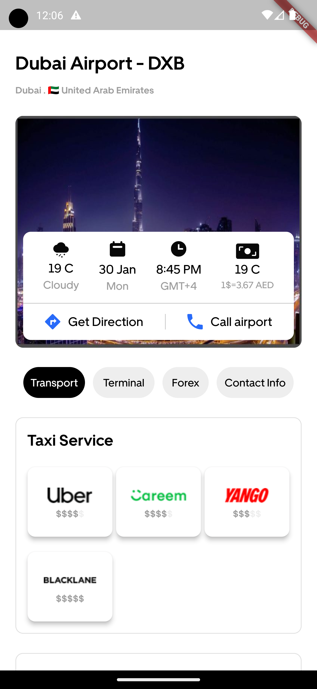
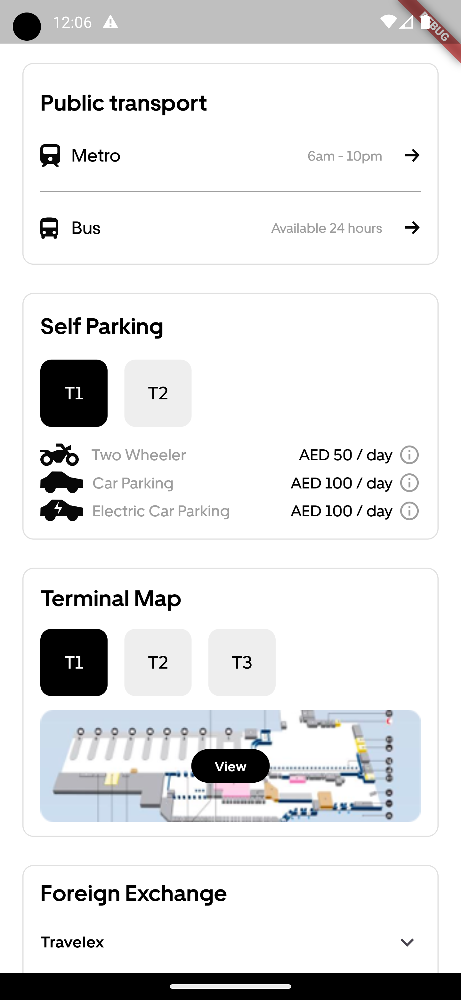
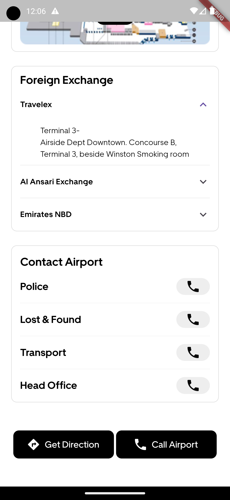

## Introduction

Hey there! I'm excited to share my submission for the Flutter Internship Assignment from Havahavai. This assignment gave me a chance to showcase my Flutter skills, especially in UI design and implementation. 😊

## Assignment Details

### Marvel Design File

The design file for this assignment was shared via Marvel. You can check it out [here](https://marvelapp.com/prototype/1076197/screen/93923389/handoff).

### Focus

My main goal was to recreate the design as closely as possible using Flutter. I made sure to pay attention to layout, colors, and basic interactions. And hey, I skipped the repeated widgets to save time! 🎨

## What I Worked On

- **Attention to Detail:** I made sure every pixel counted to match the design.
- **Code Quality:** Kept the code clean and organized, sticking to Flutter's best practices.
- **Efficiency:** Used Flutter's features like a pro to create a smooth and responsive UI.

## Screenshots

    
    
    

